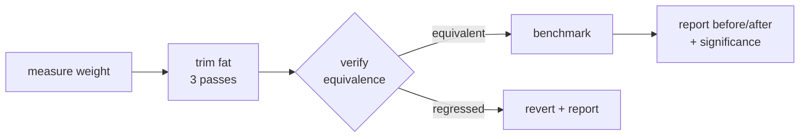

# addlightness

Simplify, then add lightness — a Claude Code plugin that strips AI-generated code fat while preserving behavior, then benchmarks the speedup.

> "Simplify, then add lightness." — Colin Chapman, Lotus

## Install

From a marketplace that lists it (inside Claude Code):

```bash
/plugin marketplace add 88plug/addlightness
/plugin install addlightness
```

Then run `./install.sh`, which chmods the hooks, lib, and benchmark scripts;
checks for node (required) and python3 (optional, for accurate `.py` metrics);
and runs a `weigh.js` smoke test.

## Quickstart (under 60s)

Point it at a bloated file:

```text
/addlightness src/foo.js
```

You get a before/after weight table and a verified, benchmarked result:

```text
src/foo.js
  metric        before   after
  weight         142.0    78.5   (-44.7%)
  LOC               61      38
  cyclomatic        14       7
  nesting            5       3
  imports            9       5
verify:  signature-match (syntax + export/signature parity held)
bench:   1.42x faster (mean 8.1ms -> 5.7ms, t=4.3, significant)
```

Every edit is gated by an equivalence check before it is reported, and every
speedup claim is gated by a statistical-significance test. Nothing ships unless
it passes both.

## Commands

| Command / piece | What it does |
| --- | --- |
| `/addlightness <file>` | Full pipeline: measure weight, trim fat, verify equivalence, benchmark the speedup. |
| `/addlightness-review <file>` | Read-only weight report and fat-candidate list. Modifies nothing. |
| `/addlightness-bench <before> <after>` | Times before/after commands and reports % improvement with significance. |

## How it works



Trimming runs in three ordered passes: **mechanical** (unused imports/vars,
no-else-return, redundant boolean compares), **semantic** (inline single-use
wrappers, collapse redundant control flow, drop only proven-impossible defensive
checks), then **style** (shorten narrow-scope identifiers, delete comments that
restate the code).

## Weight formula

Weight is a relative before/after metric — lower is lighter. It is not an
absolute industry standard.

```text
weight = 1.0*LOC + 2.0*cyclomatic + 1.5*imports + 1.0*functions + 3.0*nesting

% reduction = (before - after) / before * 100
```

Nesting (3.0) and cyclomatic complexity (2.0) are weighted highest because they
discriminate fat best; imports (1.5) penalize speculative-dependency surface; LOC
and function count (1.0) are baseline size.

## What it will NOT do

!!! warning "Defensive checks are never stripped"
    addlightness never strips defensive checks on externally-controlled inputs —
    public API parameters, IO, and parsed/network/env/user data are always kept.
    Only internally-produced, type-guaranteed values are candidates for removal.
    This is the #1 regression vector: tests pass with well-formed inputs even
    after validation is wrongly stripped.

!!! note "Two gates, always"
    Every trim is verified by `lib/equivalence.js` before being reported, and
    reverted on any regression. Every benchmark claim is gated by a Welch t-test
    against a df-aware two-tailed 95% critical value; a change that isn't
    statistically faster is reported as not significant, not as a win.

## FAQ

**Why are JavaScript/TypeScript metrics "approximate"?**
With zero npm dependencies there is no JS parser available, so JS/TS metrics are
regex-on-stripped-source approximations. Python metrics use the stdlib `ast`
module and are accurate.

**Does static equivalence prove my code still works?**
No. The static ladder is a change-magnitude and structural signal, not a
behavioral guarantee. Your own test suite is the only true runtime-equivalence
proof — run it after a trim.

## Links

- [Source on GitHub](https://github.com/88plug/addlightness)
- [Contributing](https://github.com/88plug/addlightness/blob/main/CONTRIBUTING.md)
- [Architecture notes (CLAUDE.md)](https://github.com/88plug/addlightness/blob/main/CLAUDE.md)
- [License (FSL-1.1-ALv2)](https://github.com/88plug/addlightness/blob/main/LICENSE)
