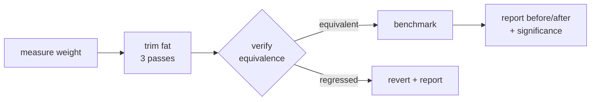

# addlightness

AI code fat trim for Claude Code and Grok — measure weight, trim, verify equivalence, and benchmark the speedup.

[](https://github.com/88plug/addlightness/actions/workflows/plugin-validate.yml)
[](https://github.com/88plug/addlightness/blob/main/LICENSE)
[](https://88plug.github.io/addlightness)
[](https://github.com/88plug/claude-code-plugins)

> "Simplify, then add lightness." — Colin Chapman, Lotus

## Install

### Claude Code

```text
/plugin marketplace add 88plug/claude-code-plugins
/plugin install addlightness@88plug
```

### Grok Build

```text
grok plugin marketplace add 88plug/claude-code-plugins
grok plugin install addlightness@88plug --trust
```


Then run `./install.sh` from the plugin root. It chmods hooks, lib, and benchmark scripts; checks for Node (required) and python3 (optional, for accurate `.py` metrics); and runs a `weigh.js` smoke test.

!!! tip
    Prefer the [88plug marketplace](https://github.com/88plug/claude-code-plugins). Installing from this repo alone works, but curated marketplace installs stay in sync with the fleet.

## Quickstart (under 60s)

Point it at a bloated file:

```text
/addlightness src/foo.js
```

You get a before/after weight table and a verified, benchmarked result:

```text
src/foo.js
  metric        before   after
  weight         142.0    78.5   (-44.7%)
  LOC               61      38
  cyclomatic        14       7
  nesting            5       3
  imports            9       5
verify:  signature-match (syntax + export/signature parity held)
bench:   1.42x faster (mean 8.1ms -> 5.7ms, t=4.3, significant)
```

Every edit is gated by an equivalence check before it is reported. Every speedup claim is gated by a statistical-significance test. Nothing ships unless it passes both.

## Why / who it's for

AI coding assistants produce code that works but carries weight: speculative abstractions, dead branches, redundant control flow, defensive checks on values that can never be malformed.

addlightness measures that weight, removes it in small verified passes, gates every change against a regression check, and only claims a speedup the Welch test confirms. Use it when you ship AI-assisted code and want the output trimmed without silently changing what it does.

## Features

| Piece | What it does |
| --- | --- |
| `/addlightness <file>` | Full pipeline: measure weight, trim fat, verify equivalence, benchmark the speedup. |
| `/addlightness-review <file>` | Read-only weight report and fat-candidate list. Modifies nothing. |
| `/addlightness-bench <before> <after>` | Times before/after commands and reports % improvement with significance. |
| `weight-analyst` agent | Read-only measurement of weight metrics; emits the fat-candidate report. |
| `code-trimmer` agent | Edit-capable trimmer bounded by the trust-boundary rule and the equivalence gate. |
| SessionStart + Stop hooks | Announce the plugin on start; gently suggest `/addlightness` on files you changed. |

## How it works



Trimming runs in three ordered passes so cheap mechanical cleanup happens before judgment work:

1. **Mechanical** — unused imports/vars, no-else-return, useless catch/return, redundant boolean compares. Lint-autofixable, zero judgment.
2. **Semantic** — inline single-use wrappers, collapse redundant control flow, drop only *proven-impossible* defensive checks.
3. **Style** — shorten identifiers in narrow private scope, delete comments that merely restate the code. Why-comments stay.

## Weight formula

Weight is a relative before/after metric — lower is lighter. It is not an absolute industry standard.

```text
weight = 1.0*LOC + 2.0*cyclomatic + 1.5*imports + 1.0*functions + 3.0*nesting

% reduction = (before - after) / before * 100
```

Nesting (3.0) and cyclomatic complexity (2.0) are weighted highest because they discriminate fat best. Imports (1.5) penalize speculative-dependency surface. LOC and function count (1.0) are baseline size. The engine also emits a token proxy and the raw component metrics so the full table can be shown.

## What it will not do

!!! warning "Defensive checks are never stripped"
    addlightness never strips defensive checks on externally-controlled inputs — public API parameters, IO, and parsed/network/env/user data always stay. Only internally-produced, type-guaranteed values are candidates for removal. This is the #1 regression vector: tests pass with well-formed inputs even after validation is wrongly stripped.

!!! note "Two gates, always"
    Every trim is verified by `lib/equivalence.js` before being reported, and reverted on any regression. Every benchmark claim is gated by a Welch t-test against a df-aware two-tailed 95% critical value (`t_crit_95`; ~2.1–2.3 at the default N=10). A change that is not statistically faster is reported as not significant, not as a win. Gate on the emitted `significant_at_95` bool — never recompute against a fixed 1.96.

The `code-trimmer` agent also hard-refuses a scope of 3 or more files at once, keeps `return await` inside try/catch, never strips `async` without checking call sites, and never blanket-deletes empty catch blocks.

## Requirements

| Tool | Status |
| --- | --- |
| Node.js >= 18 | Required (core weight engine, hooks). |
| python3 | Optional — enables accurate `.py` metrics via the stdlib `ast` module. |
| hyperfine | Optional — sharper benchmarks; falls back to a `date`+`awk` loop. |

Zero npm dependencies. Run `./install.sh` to make the scripts executable and smoke-test the weight engine (`lib/weigh.js`).

## Troubleshooting / FAQ

**Why are JavaScript/TypeScript metrics "approximate"?**
With zero npm dependencies there is no JS parser available, so JS/TS metrics are regex-on-stripped-source approximations (comments, strings, and templates are stripped first). Python metrics use the stdlib `ast` module and are accurate.

**Why was my speedup flagged "not significant"?**
The benchmark gate requires statistical significance. If the Welch `|t|` does not exceed the df-aware two-tailed 95% critical value (`t_crit_95`, ~2.1–2.3 at the default N=10), the change is reported as not significant rather than claimed as faster — even if the mean moved. Small files often fall here: runtime is noise-dominated and the Welch gate refuses to claim a win it cannot prove. Trust the emitted `significant_at_95` bool.

**Does static equivalence prove my code still works?**
No. The static ladder (syntax gate, structural/AST diff for Python, signature and export parity for JS) is a change-magnitude and structural signal, not a behavioral guarantee. Your own test suite is the only true runtime-equivalence proof — run it after a trim.

## Links

- [Source on GitHub](https://github.com/88plug/addlightness)
- [Contributing](https://github.com/88plug/addlightness/blob/main/CONTRIBUTING.md)
- [Architecture notes (CLAUDE.md)](https://github.com/88plug/addlightness/blob/main/CLAUDE.md)
- [License (FSL-1.1-ALv2)](https://github.com/88plug/addlightness/blob/main/LICENSE)

## Development

Local clone (not the primary install path):

```bash
git clone https://github.com/88plug/addlightness.git
cd addlightness
./install.sh
```

Enable the plugin from its local path via Claude Code's `/plugin` command, or add it under `enabledPlugins` in `~/.claude/settings.json` once the marketplace is resolvable (`"<plugin>@<marketplace>"` form).
